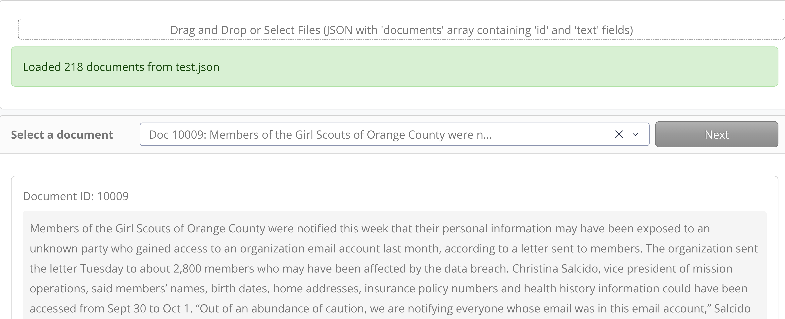

# Event Extraction Annotation Interface

## Overview

This is a comprehensive web-based annotation interface for cross-domain event extraction tasks. It allows users to annotate documents using event detection and argument extraction tasks across multiple datasets.

## Features

## Application Features (Screenshots)

This section highlights the UI features with placeholders for screenshots captured from the running `web_dash_app.py` interface.

### Document Ingestion and Selection
- Upload JSON or JSONL files and review load status.
- Select documents from a dropdown with text previews.



### Event Detection (Stage 1)
- Run trigger detection across pipeline, e2e, and merged modes.
- Compare mode outputs with tabs, badges, and character offsets.


### Argument Extraction (Stage 2)
- Extract arguments from detected triggers with role labels.
- Review event cards and structured argument lists per mode.


### Combined Annotation View
- Visualize triggers and arguments together with consistent event colors.
- Compare modes with tabbed views.


### Complete End-to-End Extraction
- Run complete e2e extraction in one step.
- Inspect both combined annotations and event cards.


### Saving Results Across Schemas
- Save stage 1/2 and complete e2e outputs with schema-aware labels.
- Continue annotating the same document across datasets.


### 1. **File Upload**
- Upload JSON files containing document strings
- Expected format: `{"documents": [{"id": "doc1", "text": "..."}, ...]}`
- Supports batch processing of multiple documents

### 2. **Dataset (Event Schema) Selection**
- Choose from 6 datasets:
  - **geneva**: General semantic event frames covering 120+ event types (communication, movement, conflict, commerce, change of state, etc.) based on FrameNet-style semantics
  - **wikievents**: Hierarchical event schema with 50+ event types across categories of Battle, Revolution, Revolt, Campaign, etc from Wikipedia text. []()
  - **casie**: Cybersecurity incidents,  focusing on five event types: Databreach, Phishing, Ransom, Discover, and Patch. [](https://github.com/Ebiquity/CASIE)
  - **genia2013**: Biomedical events
  - **m2e2**: Multimedia events
  - **rams**: News events

### 3. **Model Type Selection**
- **Domain-Specific**: Individual models trained per dataset
- **Cross-Domain**: Single model trained on all 6 datasets

### 4. **Multi-Stage Workflow**

#### Stage 1: Event Detection
Detect and classify event triggers with three modes:
- **Pipeline Mode**: Trigger Identification → Classification (sequential)
- **E2E Mode**: Joint trigger identification and classification
- **Merged Mode**: Combines results from both pipeline and e2e modes

Results are displayed with:
- Trigger text highlighting in the source document
- Event type badges
- Character offset information

#### Stage 2: Argument Extraction
Extract event arguments based on detected triggers:
- Arguments shown with role labels
- Color-coded highlights for different argument roles
- Support for arguments from different detection modes

#### Stage 3: Multi-Dataset Annotation
- After validation, seamlessly switch to another dataset
- Annotate the same document with different dataset schemas
- Save results for multiple datasets hierarchically

### 5. **Result Saving**
Results are saved with hierarchical structure:
```json
{
  "doc_id": "...",
  "source": "...",
  "events": {
    "geneva": {
      "pipeline": [{"trigger": {...}, "arguments": [...]}, ...],
      "e2e": [...],
      "merged": [...]
    },
    "m2e2": {
      "pipeline": [...],
      "e2e": [...],
      "merged": [...]
    }
  }
}
```

## Installation

### Dependencies
```bash
pip install dash dash-bootstrap-components transformers torch
```

### Required Files
- `web_infer.py`: Core inference functions
- `pattern_tagprime.py`: Event schema definitions
- Trained T5 models in `/nfs/work/debi5729/`

## Running the Application

```bash
python web_dash_app.py
```

The application will start at `http://localhost:8050`

## User Workflow

### Step 1: Load Documents
1. Upload a JSON file with documents
2. File should have format: `{"documents": [{"id": "...", "text": "..."}, ...]}`

### Step 2: Configure
1. Select a dataset (e.g., "geneva")
2. Choose model type (domain-specific or cross-domain)

### Step 3: Select Document
- Pick a document from the dropdown

### Step 4: Run Event Detection
- Click "Run Event Detection"
- View triggers in pipeline mode, e2e mode, and merged mode
- Highlighted text shows where triggers were found

### Step 5: Validate & Extract Arguments
- Click "Validate & Extract Arguments"
- Review argument extraction results
- Argument roles are color-coded

### Step 6: Save Results
Two options:
- **Save & Switch Dataset**: Save current results and annotate the same document with a different dataset
- **Save & Finish**: Complete annotation and save all results

## Key Features

### Visual Highlighting
- **Yellow**: Pipeline mode triggers
- **Blue**: E2E mode triggers
- **Green**: Merged mode triggers
- **Colored underlines**: Argument roles (auto-assigned from palette)

### Smart Result Display
- Triggers shown in multiple tabs (pipeline/e2e/merged)
- Events grouped with their triggers and arguments
- Offset information for debugging

### Model Caching
- Models are cached in memory to avoid reloading
- Efficient for processing multiple documents

## GPU Capacity Planning (T5-Base)

Assumptions used for the table below:
- T5-Base has 220M parameters
- FP32 weights only ($4$ bytes/parameter)
- Storage and inference GPU memory are weights-only (no activation buffers)

Per-model weight size (FP32):
$$
220\text{M} \times 4\text{ bytes} \approx 0.82\text{ GiB}
$$

| Scenario | Models Loaded | Storage for Models (GiB) | Inference GPU Memory (GiB) |
| --- | --- | ---: | ---: |
| Only cross-domain model | 1 | 0.82 | 0.82 |
| One domain-specific + cross-domain | 2 | 1.64 | 1.64 |
| All models (6 domain-specific + cross-domain) | 7 | 5.74 | 5.74 |

If you plan to run larger batch sizes or longer sequences, add extra headroom for activations.

### Error Handling
- Model not found errors with helpful messages
- Graceful handling of empty predictions
- Detailed error messages for debugging

## Output Format

Results are saved in JSON with the following structure:

```json
{
  "doc_id": "unique_document_id",
  "source": "original_text",
  "events": {
    "dataset_name": {
      "pipeline": [
        {
          "trigger": {
            "text": "word",
            "type": "EventType",
            "offset": [start, end]
          },
          "arguments": [
            {
              "text": "arg_text",
              "role": "Role",
              "offset": [start, end]
            }
          ]
        }
      ],
      "e2e": [...],
      "merged": [...]
    }
  }
}
```

## Configuration

### Model Paths
Update in `get_model_path()` function:
- Cross-domain: `/nfs/work/debi5729/google-t5-t5-base_split1_geneva_wikievents_casie_genia2013_m2e2_rams_amount_1_e2e_True_full_latest_expressive_prompt`
- Domain-specific: `/nfs/work/debi5729/google-t5-t5-base_split1_{dataset}_amount_1_e2e_True_full_latest_expressive_prompt`

### Output Directory
Annotation results are saved to:
`/user/debi5729/Cross-Domain-Text-Event-Extraction/annotation_results/`

## Troubleshooting

### Model Not Found
- Check that model directories exist
- Verify dataset name is correct
- Ensure CUDA is available if using GPU

### Memory Issues
- Close browser and restart if memory leaks
- Model caching may accumulate memory
- Consider running with smaller max_length

### Empty Results
- Check input text is not empty
- Model may return empty predictions for unrelated text
- Try different model type (domain-specific vs cross-domain)

## Integration with web_infer.py

The application uses these functions from `web_infer.py`:
- `run_single_inference_event_detection()`: Run trigger detection
- `parse_and_merge_single_inference_event_detection_results()`: Parse and merge results
- `run_single_inference_event_argument_extraction()`: Extract arguments
- `structure_argument_extraction_pipeline_predictions()`: Structure argument results

## Performance Notes

- First inference per dataset/model combination takes longer (model loading)
- Subsequent inferences use cached model
- GPU acceleration recommended for faster inference
- Typical inference time: 1-5 seconds per document

## Future Enhancements

- [ ] Batch document processing
- [ ] Real-time model selection
- [ ] Custom schema support
- [ ] Export to various formats (CSV, XML)
- [ ] Collaborative annotation with multiple users
- [ ] Model training from UI
